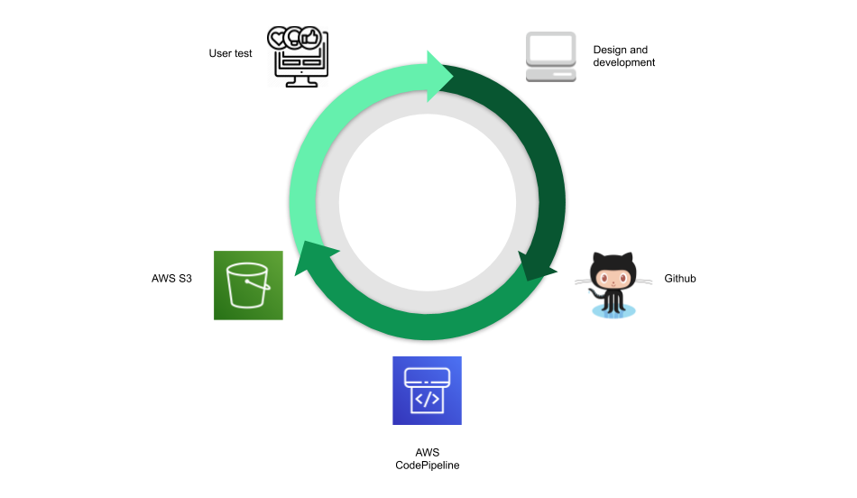

# HTML/CSS/JS prototypes

## Rapid Prototyping with AWS CodePipeline and S3 for iterative design and user testing

A setup for building rapid HTML/CSS/JS prototypes using AWS CodePipeline and a S3 bucket.

* [AWS CodePipeline](https://aws.amazon.com/codepipeline/)
* [AWS S3 buckets](https://aws.amazon.com/s3/)

Visit HTML prototype homepage:

http://tna-prototypes.s3-website-eu-west-1.amazonaws.com/
